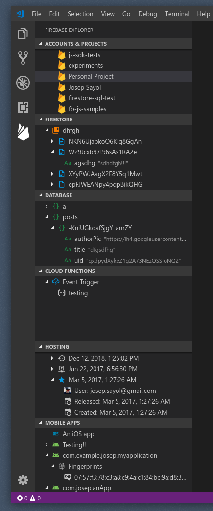

# Firebase Explorer
A Visual Studio Code extension to explore and manage your Firebase projects.


## Instalation
Launch VS Code Quick Open (`Ctrl+P`), paste the following command, and press enter:
```
ext install jsayol.firebase-explorer
```

Or you can just search for "Firebase Explorer" in the Extensions view.

## Preview


